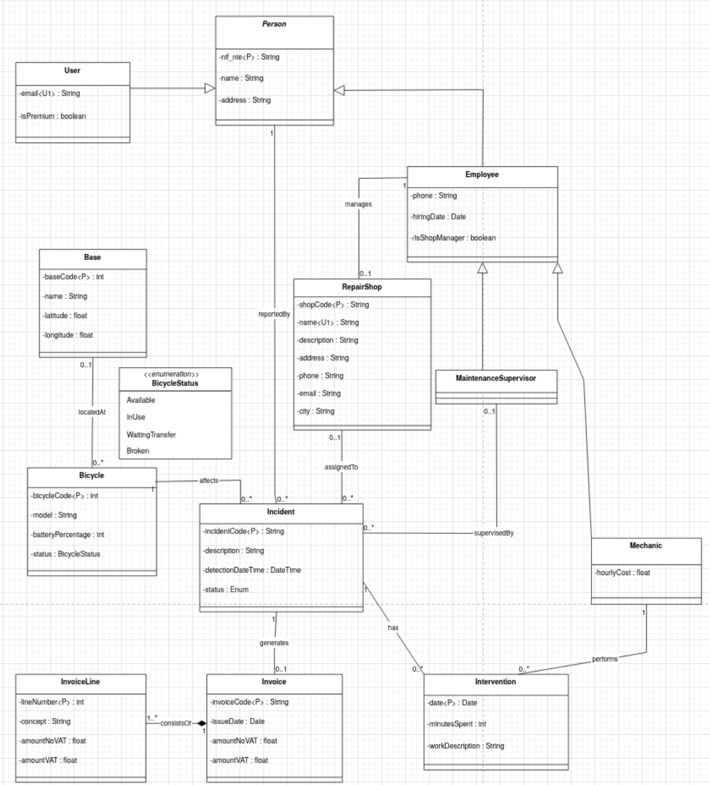
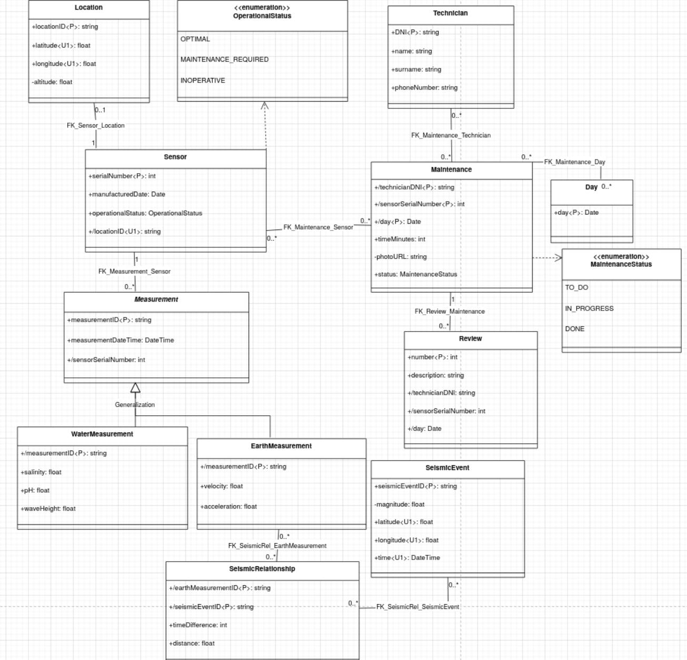

# PR 1
Alejandro Pérez Bueno
Nov 25, 2025

- [Exercise 1](#exercise-1)
- [Exercise 2](#exercise-2)
- [Exercise 3](#exercise-3)
  - [a) Rental1](#a-rental1)
  - [b) Rental2](#b-rental2)



## Exercise 1

Constraints:

1.  **PK Constraints:**
    - `InvoiceLine`: Primary Key is composite
      `(InvoiceCode, LineNumber)`.
    - `Intervention`: Primary Key is composite
      `(IncidentCode, MechanicNIF, Date)`.
2.  **Data Integrity:**
    - `Bicycle.batteryPercentage`: Must be integer between 0 and 100.
    - `User.email`: Must be Unique.
    - `RepairShop.name`: Must be Unique.
3.  **Business Logic:**
    - A `Bicycle` cannot be at a `Base` if its status is ‘In Use’ or
      ‘Broken’.
    - An `Employee` cannot be both a `Mechanic` and a
      `MaintenanceSupervisor` (Disjoint).
    - `Person` hierarchy is overlapping (Employee can be User).

## Exercise 2

## Exercise 3

### a) Rental1

The relation `Rental1` is currently in 1NF because all the attributes
are atomic (as there are no repeating groups or lists).

However, it is not in 2NF. For a relation to be in this form, non-key
attributes must depend on the *entire* primary key, not just part of it.
The primary key here is `{momentStart, idUser, codeBicycle}`. Looking at
the dependencies:

- The user’s `name` and `phone` depend only on `idUser`, which is just a
  part of the primary key.
- The bicycle `model` depends only on `codeBicycle`, which is also just
  a subset of the key.

Because these partial dependencies exist, the relation suffers from
redundancy and update anomalies.

**Process of transforming it to BCNF:**

To reach BCNF, we need to decompose the relations so that every
determinant is a candidate key.

**Fixing Partial Dependenciesto reach 2NF**

We have to to separate the attributes that depend on partial keys into
their own tables.

1.  **User Data:** We can put `name` and `phone` in a separate relation
    keyed by `idUser`.
2.  **Bicycle Data:** We should again put `model` and `batteryType` in a
    relation keyed by `codeBicycle`.
3.  **Rental Data:** The original relation keeps the full primary key
    plus the attributes that actually depend on the specific rental
    instance (momentEnd and `price`).

After the above changes, we have the follownig:

- `Users` (idUser, name, phone)
- `Bicycles_Temp` (codeBicycle, model, batteryType)
- `Rentals` (momentStart, idUser, codeBicycle, momentEnd, price)

**Fixing 3NF/BCNF by removing transitive dependencieses)**

Looking at the `Bicycles_Temp` table created above, there is still an
issue. The `batteryType` depends on the `model`, and the `model` depends
on the `codeBicycle`.

- Dependency: `model -> batteryType`

Since `model` is not a candidate key for the specific bicycle (many
bikes can be the same model), this is a **transitive dependency**, which
violates 3NF and BCNF. To fix this, we need to create a reference table
for models\>

1.  Create a `Models` relation where `model` is the key and determines
    `batteryType`.
2.  Update the `Bicycles` relation to only hold the `model` as a foreign
    key

**Final BCNF**

After these steps, every determinant in the relations is a candidate
key, as shown below:

1.  **Rentals** (**momentStart**, **idUser**, **codeBicycle**,
    momentEnd, price)
    - *Foreign Keys:* `idUser` references `Users`, `codeBicycle`
      references `Bicycles`
2.  **Users** (**idUser**, name, phone)
3.  **Bicycles** (**codeBicycle**, model)
    - *Foreign Keys:* `model` references `Models`
4.  **Models** (**model**, batteryType)

### b) Rental2

**Current State & Justification:**

The relation `Rental2` is 2NF. Unlike before, the primary key here
(`numberRental`) is a single attribute (an incrementing number). 2NF
violations appear when an attribute depends on only *part* of a
composite primary key. Since the key has no “parts to split, it is
impossible to have a partial dependency.

However the relation is not 3NF, thus also not in BCNF. This is due to
it having transi\`tive dependencies. Non-key attributes are determining
other non-key attributes. For example:

- `numberRental` determines `idUser`, but `idUser` then determines
  `name` or `phone`. This creates a chain of “numberRental -\> idUser
  -\> name” which is not good practice.
- Similarly, `numberRental` determines `codeBicycle`, which determines
  `model`, which in its turn also determines `batteryType`.

To reach BCNF, these transitive dependencies must be removed by
separating the data into distinct relations where every determinant is a
candidate key.

**Transformation to BCNF**

**Extracting User Info**

The attributes `name` and `phone` depend on `idUser`, not on the rental
transaction itself. We can remove this transitive dependency by creating
a separate table for users.

- **New Relation:** `Users` (**idUser**, name, phone)
- **Modified Rental:** `Rental2` retains `idUser` as a foreign key but
  loses `name` and `phone`.

**Extracting Bicycle and Model Info**

There is a nested dependency chain here: codeBicycle -\> model -\>
batteryType. If we simply moved all bicycle info to one table, we would
still have a 3NF violation because `batteryType` depends on `model`, not
strictly on the specific `codeBicycle`. Therefore, this needs to be
split into two parts:

1.  **Model Data:** We create a relation to store the features that
    belong to a model type.
    - **New Relation:** `Models` (**model**, batteryType)
2.  **Bicycle Data:** We can create a relation for the specific physical
    bikes, linking them to their model.
    - **New Relation:** `Bicycles` (**codeBicycle**, model)

**Final BCNF**

The original `Rental2` relation is now reduced to just the transaction
details, referencing the other entities via foreign keys.

1.  **Rentals** (**numberRental**, momentStart, idUser, codeBicycle,
    momentEnd, price)
    - *Foreign Keys:* `idUser` references `Users`, `codeBicycle`
      references `Bicycles`.
2.  **Users** (**idUser**, name, phone)
3.  **Bicycles** (**codeBicycle**, model)
    - *Foreign Keys:* `model` references `Models`.
4.  **Models** (**model**, batteryType)
